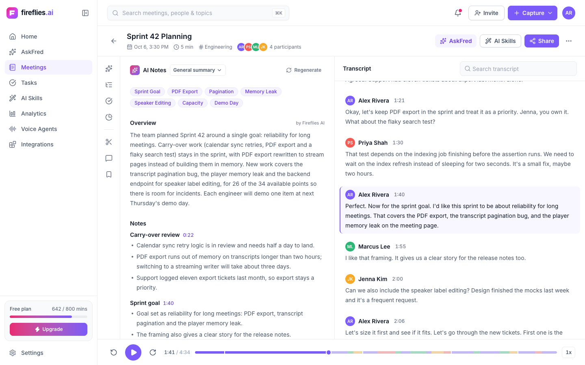
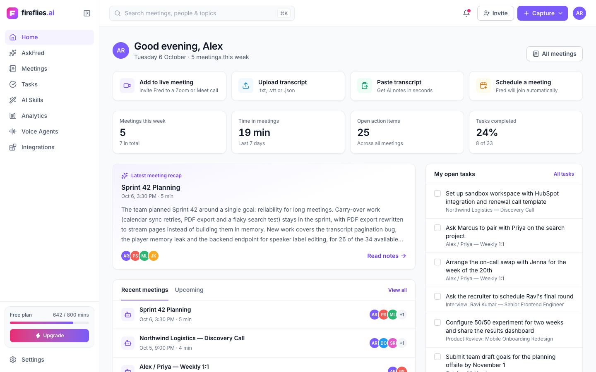
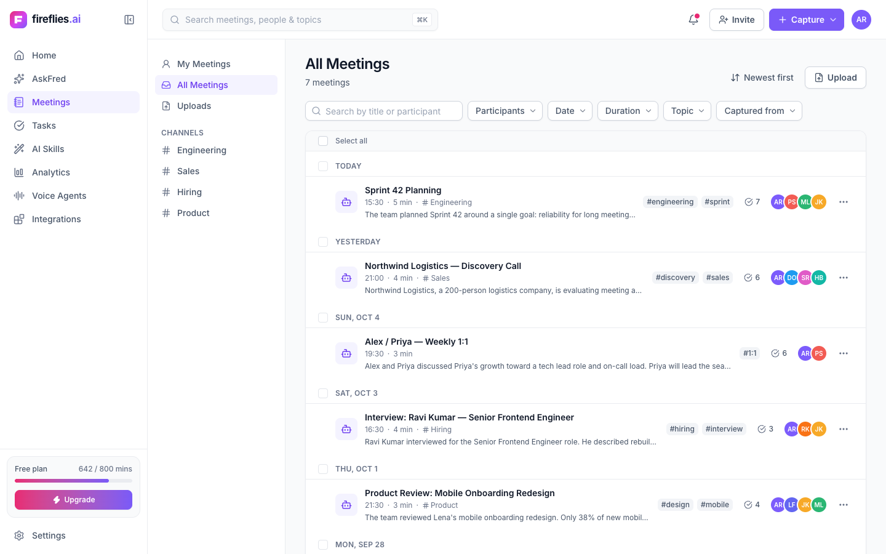
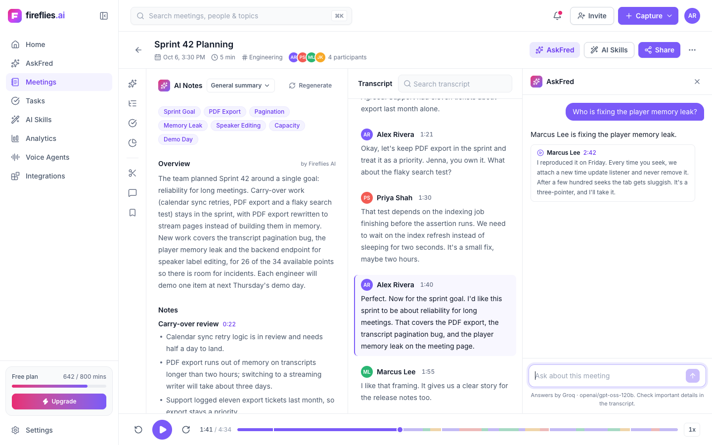
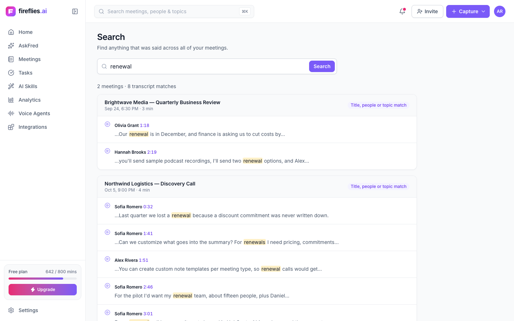
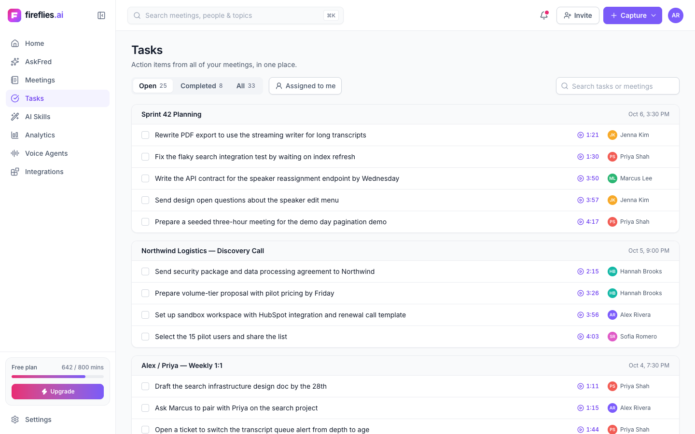
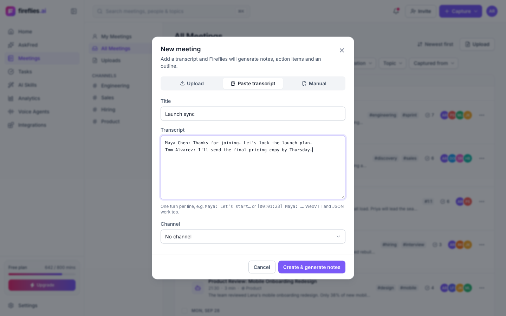
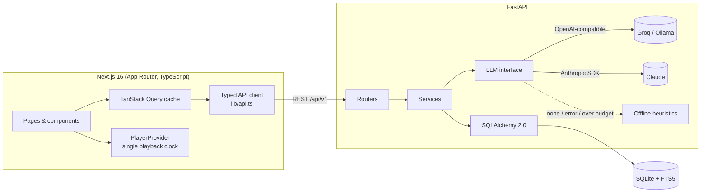
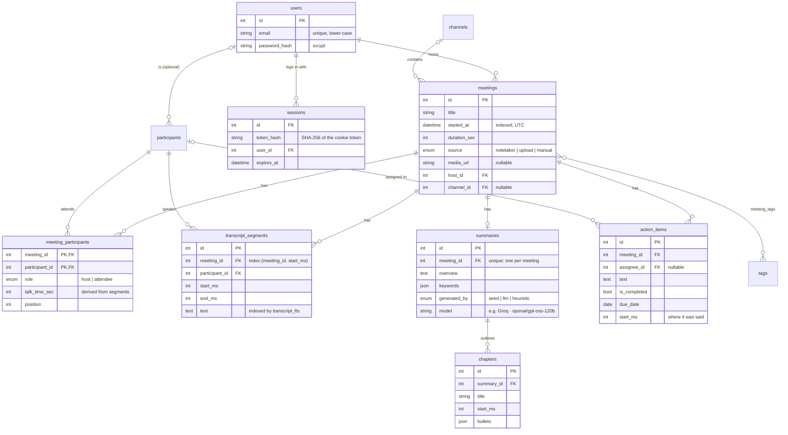

# Fireflies.ai Clone

A full-stack clone of the [Fireflies.ai](https://fireflies.ai) meeting assistant: a meetings library, a "Notepad" meeting page where the **transcript, audio player and AI notes stay in sync**, action items, global search and an AskFred chat that cites the transcript.

**Live demo:** https://fireflies-clone-woad.vercel.app · **API docs:** https://fireflies-clone-api-0aet.onrender.com/docs · **Stack:** Next.js 16 (TypeScript) · FastAPI · SQLite

> The API runs on Render's free tier and sleeps when idle, so the first load after a pause can take up to a minute.



| Home | Meetings library |
|---|---|
|  |  |
| **AskFred (Groq)** | **Global search** |
|  |  |
| **Tasks** | **New meeting (upload / paste / manual)** |
|  |  |

---

## Features

### Core (assignment requirements)
| Requirement | Where |
|---|---|
| Meetings list with title, date, duration, participants | `/meetings`: grouped by day, source icon, summary snippet, topics, action-item count, avatars |
| Search & filter (title, date, participant) + sort by recency | Debounced search; participant, date-range (presets + custom), duration, topic and source filters; 5 sort orders; **state lives in the URL** |
| Navbar with profile/settings | Fireflies sidebar + top bar (⌘K search, notifications, Capture menu, profile menu with dark mode) |
| Interactive transcript with speakers & timestamps | Speaker blocks with avatars; active line highlighted while playing |
| Media player with seek bar | Real audio for seeded meetings; play/pause, ±15s, speed, keyboard shortcuts, accessible seek slider showing *who spoke when* |
| Click transcript → seek, and vice versa | Click any line/timestamp/outline chapter/action item to seek; playback auto-scrolls the transcript (pauses when you scroll, with "Resume auto-scroll") |
| Search within transcript with highlights | Find bar with match count, next/previous (Enter / Shift+Enter); keyword chips search the transcript |
| AI summary, action items, outline/chapters | Overview, keywords, timestamped outline, action items grouped by assignee, speaker talk time |
| CRUD for meetings & action items, persisted | Create (upload `.txt/.vtt/.json`, paste, or form), edit title/participants/channel/topics, delete (with bulk actions); add/edit/assign/complete/delete action items (optimistic, with Undo) |
| Fireflies experience | Fireflies palette & layout, modals, toasts, empty/loading/error states, "Coming soon" pages for Integrations, live bot, sharing, analytics |

### Beyond the brief
- **Landing page** at `/` following fireflies.ai's structure (hero, product sections, capture methods, search & AskFred, privacy, FAQ, CTA, footer), with original copy and real product screenshots.
- **Email/password accounts**: sign up, log in (with a one-click demo account), log out. Sessions are server-side and stored as token hashes in an `HttpOnly`, `SameSite=Lax` cookie; passwords use salted scrypt; logins are rate-limited. All accounts share one workspace.

### Bonus
- **AskFred**: ask questions about a meeting; answers cite transcript lines that seek and play the audio. Uses Groq when configured, otherwise a keyword-retrieval fallback.
- **Global search** across every transcript (SQLite FTS5 with stemming, prefix matching, ranking and highlighted snippets), opening meetings at the matching moment.
- **Export** notes, action items and transcript as Markdown or plain text.
- **Topics/tags** with filtering, **Tasks** page across meetings, **Home** dashboard, **dark mode**, responsive down to phone width.
- **Deep links**: `/meetings/1?t=101000` opens a meeting at 1:41.

---

## Quick start

Requirements: Python 3.11+, Node 20+.

```bash
# Backend: http://localhost:8000 (interactive API docs at /docs)
cd backend
python3 -m venv .venv && source .venv/bin/activate
pip install -r requirements-dev.txt
cp .env.example .env              # works as-is in offline mode
python -m app.seed.seed           # 7 demo meetings with audio, notes and action items
uvicorn app.main:app --reload

# Frontend: http://localhost:3000
cd frontend
npm install
cp .env.example .env.local        # BACKEND_URL=http://localhost:8000 (proxied at /api/v1)
npm run dev
```

Open http://localhost:3000 for the landing page, then **Log in → Try the demo account** (`alex@nimbus.io` / `fireflies-demo`) or create an account. Sample transcripts for the upload flow are linked from the upload dialog (`frontend/public/samples/`).

### AI modes
Every AI feature works without a key. Pick a provider in `backend/.env`:

| `LLM_PROVIDER` | What happens |
|---|---|
| `none` (default) | Offline heuristics: keyword-ranked summaries/outline/action items; AskFred quotes the most relevant transcript lines |
| `openai` | Any OpenAI-compatible API. Defaults to **Groq** (`openai/gpt-oss-120b`, free tier); set `LLM_BASE_URL=http://localhost:11434/v1` for Ollama |
| `claude` | Anthropic API via `ANTHROPIC_API_KEY` |

On a public deployment, LLM calls are capped per client (20/hour) and globally (300/day). Past the cap, or if the provider errors, requests quietly fall back to the offline mode, so the demo can't be used to drain an API quota.

### Tests & checks
```bash
cd backend  && pytest && ruff check app tests          # 32 API/service tests (no network, no keys)
cd frontend && npm test && npm run lint && npm run typecheck && npm run build
```

---

## Architecture



**Backend** (`backend/app/`): layered so each piece has one job.
- `routers/`: HTTP only (validation, status codes): meetings, transcripts, action items, AI & search, lookups.
- `services/`: domain logic, no HTTP:
  - `meeting_service` handles creation, participants, talk time and filtered queries.
  - `transcript_parser` reads WebVTT, JSON and text.
  - `summarizer` and `ask_service` produce notes and answers.
  - `search_service`, `export_service`.
  - `llm` is the provider interface; `rate_limit` is the LLM budget.
- `models/` and `schemas/`: SQLAlchemy tables and Pydantic request/response models, kept separate so the API shape isn't the storage shape.
- `seed/`: demo data (JSON) and `generate_audio.py`, which voiced the transcripts with macOS TTS and re-timed them to the audio.

**Frontend** (`frontend/src/`):
- `app/`: routes. Pages are thin; feature components do the work.
- `components/`: grouped by feature (`layout`, `meetings`, `notepad`, `tasks`, `search`, `home`) plus `ui/` primitives (Button, Modal, Menu, TokenInput…) built on Radix for accessibility.
- `hooks/`: URL-backed filter state, mutations with optimistic updates.
- `lib/`: the typed API client and query keys, formatting, and pure transcript helpers (`findActiveIndex` is a binary search over segment starts), which are unit-tested.

**Player ↔ transcript sync.** `PlayerProvider` is the single source of truth for playback time. With a recording it drives a hidden `<audio>` element; without one it runs a wall-clock timer, so seeking, speed and highlighting behave the same either way. Time and controls live in separate React contexts, so buttons and click handlers don't re-render ~10 times a second while playing.

---

## Database schema



Design notes:
- **People vs users.** `participants` is separate from `users` because most speakers (customers, candidates) aren't workspace members. `participants.user_id` links the two when they are. Per-meeting facts (role, talk time) live on the `meeting_participants` association, not on either side.
- **Integrity in the database.** Foreign keys are enforced (`PRAGMA foreign_keys=ON`). Every child of a meeting uses `ON DELETE CASCADE`, so deleting a meeting is one statement. Speakers can't be deleted while they have transcript lines (`RESTRICT`). Removing an assignee unassigns their tasks (`SET NULL`).
- **Times in milliseconds** for transcript, chapter and action-item positions, so they map directly onto the player. All datetimes are stored as naive UTC; inputs with an offset are converted.
- **Full-text search.** `transcript_fts` is an FTS5 *external-content* table: it holds only the index and reads text from `transcript_segments`. Triggers keep it in sync on insert, update and delete, including cascaded deletes. It's created by a startup hook, so existing databases get it too.
- **Indexes** match the queries: `(meeting_id, start_ms)` for transcripts, `started_at` for the library sort, plus foreign-key and `is_completed` indexes for filters and Tasks.

---

## API overview

Base URL `/api/v1`. Interactive OpenAPI docs are at `/docs`.

| Method | Path | Purpose |
|---|---|---|
| GET | `/meetings` | List with `q`, `participant_id` (repeatable, all must attend), `date_from`, `date_to`, `min_duration`/`max_duration` (min), `channel_id`, `tag`, `source`, `host_id`, `sort`, `page`, `page_size` |
| POST | `/meetings` | Create from a form, optionally with pasted transcript text (notes are generated) |
| POST | `/meetings/upload` | Multipart upload of `.txt` / `.vtt` / `.json` (≤ 2 MB) → parse → persist → summarize |
| GET / PATCH / DELETE | `/meetings/{id}` | Detail (participants, summary, action items) / edit title, participants, channel, tags / delete (cascades) |
| GET | `/meetings/{id}/transcript?q=` | Segments, plus ids of segments matching `q` |
| PATCH | `/segments/{id}` | Edit text or reassign speaker (talk time recomputed) |
| GET | `/meetings/{id}/summary` | AI notes |
| POST | `/meetings/{id}/summary/regenerate` | Rebuild notes (keeps user-edited action items) |
| GET / POST | `/meetings/{id}/action-items` | List / create |
| PATCH / DELETE | `/action-items/{id}` | Edit text, assignee, due date, completion / delete |
| GET | `/action-items?completed=` | All tasks across meetings (Tasks page) |
| POST | `/meetings/{id}/ask` | AskFred: `{question, history}` → `{answer, citations[], source, model}` |
| GET | `/search?q=` | Meetings matching title/people/topics plus FTS transcript hits with snippets |
| GET | `/meetings/{id}/export?format=md\|txt` | Download notes + transcript |
| POST | `/auth/signup`, `/auth/login`, `/auth/logout` | Create account / log in (sets the `ff_session` cookie) / revoke the session |
| GET | `/auth/me`, `/auth/demo` | Current user (401 if not logged in) / public demo credentials |
| GET | `/users/me`, `/participants`, `/channels`, `/tags`, `/app-info`, `/health` | Lookups, active AI mode, health check |

Everything except `/auth/*` and `/health` requires a session (401 otherwise; a dead cookie is cleared in the same response).

Errors use FastAPI's `{"detail": ...}` shape with meaningful status codes: 404 for unknown ids, 409 when regenerating notes for a meeting without a transcript, 413 for oversized uploads, 415 for unsupported file types, and 422 for validation or parse errors such as "Segment 0 is missing 'text'".

---

## Assumptions & scope

- **One shared workspace.** Every account sees the same meetings (a single team); whoever creates a meeting is its host. The seeded demo account is Alex Rivera. Password reset, email verification and OAuth are out of scope.
- **Clone notice.** The landing and auth pages state that this is an unaffiliated demo, since it collects passwords on a look-alike page.
- **No speech-to-text.** Meetings come from transcripts. The seeded meetings' audio was generated with text-to-speech so the player has something real to play. Uploaded transcripts have no recording, so the player runs on a timer.
- **Placeholders ("Coming soon")** cover the live meeting bot, calendar sync, integrations, sharing and teams, AI Skills, Analytics, Voice Agents and cross-meeting AskFred.
- **The offline summarizer is heuristic** (keyword frequency, sentence scoring, commitment phrases such as "I'll…"). It's good enough to demo but can flag non-tasks. LLM mode is clearly better and records the model on each summary.
- **SQLite** per the brief. On Render's free tier the file is ephemeral and the demo data re-seeds after a restart; attach a persistent disk to keep data (see `render.yaml`).
- **Brand.** The UI recreates Fireflies' layout, palette (violet `#7A5AF8`, Untitled-UI greys) and Inter type for this assignment, but uses its own logo mark and letter tiles instead of third-party logos.

## Deployment

- **Backend → Render:** `render.yaml` blueprint. It seeds demo data on first boot and reads `CORS_ORIGINS` and `LLM_API_KEY` from the dashboard; secrets never go in git.
- **Frontend → Vercel:** the `frontend` folder is linked to the `fireflies-clone` project and deployed with `vercel deploy --prod`. `BACKEND_URL=https://fireflies-clone-api-0aet.onrender.com` makes Next.js proxy `/api/v1/*` to the API, so the session cookie is first-party on the Vercel domain (browsers block third-party cookies) and no CORS is needed.
- Free Render instances sleep when idle, so the first request after a pause can take up to a minute while the API wakes.
